# Assesment 1

### creating the tables and inserting the records

```sql
create table Students (
   student_id  INT PRIMARY KEY,
   first_name varchar(40),
   last_name varchar(40),
   date_of_birth varchar(20),
   email varchar(40),
   phone_number bigint);

insert into students (student_id, first_name, last_name, date_of_birth, email, phone_number)
values
(1, 'neha', 'reddy', '2003-10-18', 'neha.reddy@gmail.com', 7989857793),
(2, 'keth', 'smily', '2003-03-13', 'keth.smily@gmail.com', 9876543210),
(3, 'nikku', 'bro', '2005-07-09', 'nikku.bro@gmail.com', 1234567890);

create table Teachers(
   teacher_id int Primary Key,
   first_name varchar(40),
   last_name varchar (40),
   email varchar(40));

insert into teachers (teacher_id, first_name, last_name, email)
values
(1, 'raghav', 'kumar', 'raghav.kumar@proclink.com'),
(2, 'saranya', 'allu', 'saranya.allu@proclink.com'),
(3, 'srinivas', 'kudikala', 'srinivas.kudikala@proclink.com')


create table Courses(
   course_id int Primary Key,
   course_name varchar(40),
   credits int ,
   teacher_id  int,
   FOREIGN KEY (teacher_id) REFERENCES Teachers(teacher_id)
   );

insert into courses (course_id, course_name, credits, teacher_id)
values
(101, 'html', 3, 1),
(102, 'sql', 4, 2),
(103, 'javasrcript', 3, 1);


create table Enrollments(
   enrollment_id int  Primary Key,
   student_id int,
   course_id int,
   enrollment_date date,
   foreign key (student_id) REFERENCES Students(student_id),
   foreign key (course_id) REFERENCES Courses(course_id)
   );

insert into enrollments (enrollment_id, student_id, course_id, enrollment_date)
values
(1, 1, 101, '2023-01-10'),
(2, 2, 102, '2023-01-15'),
(3, 3, 103, '2023-01-20');

create table Payments(
   payment_id  int Primary Key,
   student_id int ,
   amount int ,
   payment_date varchar(20),
   FOREIGN KEY (student_id) REFERENCES Students(student_id)
   );

insert into payments (payment_id, student_id, amount, payment_date)
values
(1, 1, 50000, '2023-02-05'),
(2, 2, 60000, '2023-02-10'),
(3, 3, 45000, '2023-02-15');

select * from Students;
select * from Teachers;
select * from Courses;
select * from Enrollments;
select * from Payments;

drop table Students;
drop table Teachers;
drop table Courses;
drop table Enrollments;
drop table Payments;

```

## 1. Write an SQL query to insert a new student named John Doe into the "Students" table.

```sql
insert into Students
(student_id, first_name, last_name, date_of_birth, email, phone_number)
values
(4, 'John', 'Doe', '2002-09-04', 'john.doe@gmail.com', 5564646590);
```

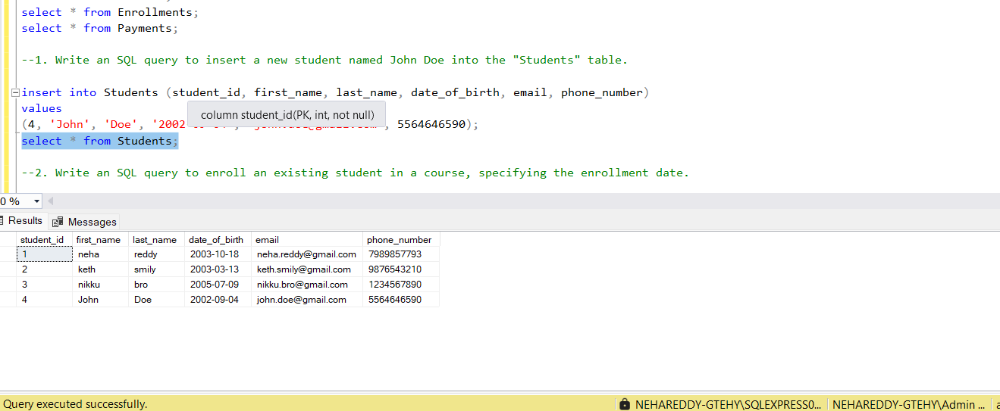

## 2. Write an SQL query to enroll an existing student in a course, specifying the enrollment date.

```sql
insert into Enrollments
(enrollment_id, student_id, course_id, enrollment_date)
values
(4, 1, 102, getdate());
```

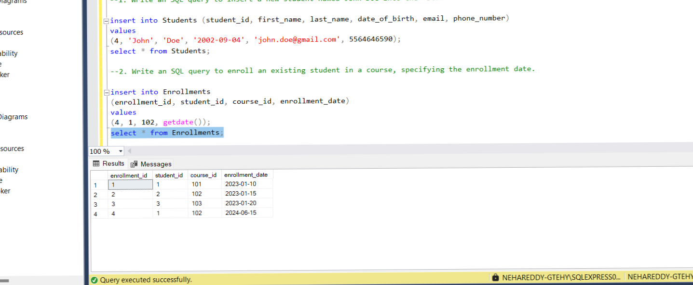

## 3. Update the email address of a teacher in the "Teachers" table.

```sql
update Teachers
set email = 'hrdepartment.saranya@gmail.com'
where teacher_id = 2;
select * from teachers;
```

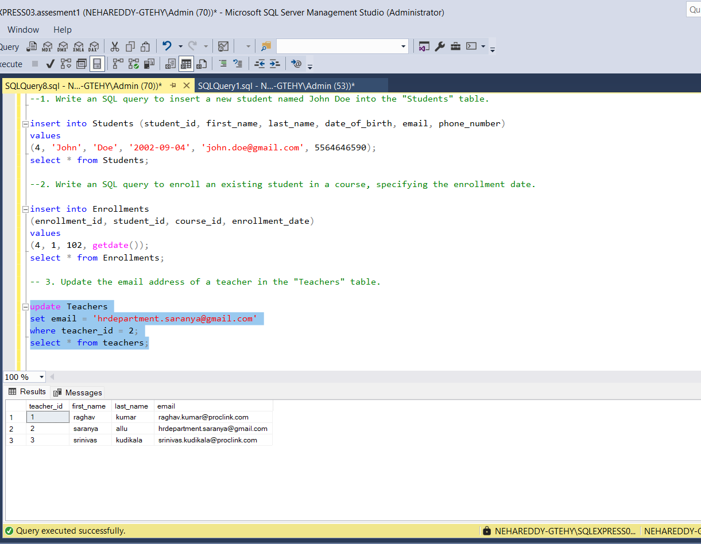

## 4. Write an SQL query to delete a specific enrollment record, choosing based on the student and course.

```sql
delete from Enrollments
where student_id = 1
and course_id = 102
and enrollment_date = '2024-06-15';
select * from Enrollments;
```

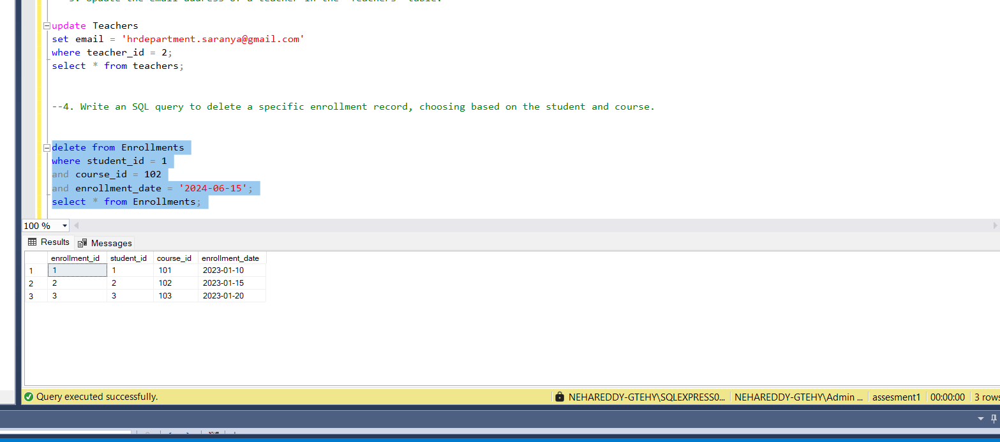

## 5. Update a course to assign a specific teacher using the "Courses" table.

```sql
update courses
set teacher_id =  2
where course_id = 101
select * from courses;
```

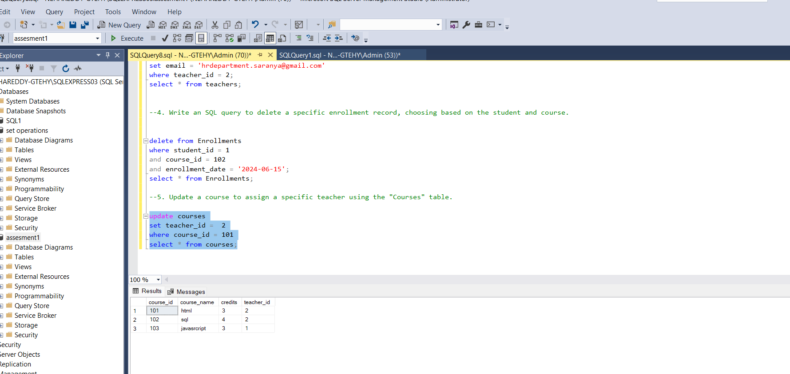

## 6. Write an SQL query to calculate the total payments made by a specific student.

## 7. Retrieve a list of courses along with the count of students enrolled in each.

```sql
select student_id, count(student_id)
as countofcourses
from courses c
join Enrollments E
on c.course_id= E.course_id
group by student_id;

```

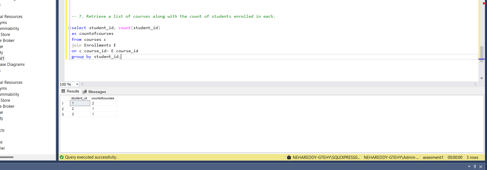

## 8. Find the names of students who have not enrolled in any course.

```sql
select first_name, last_name
from Students s
where s. student_id not in (select student_id from Enrollments)
```

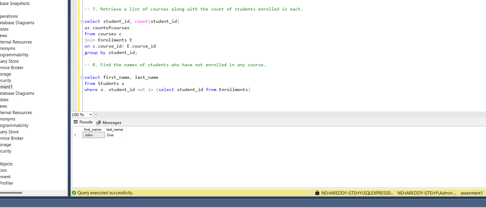

## 9. Retrieve the first name and last name of students, along with the names of the courses they are enrolled in.

```sql
select first_name, last_name , course_name
from Students s
join Enrollments e
on s.student_id = e.student_id
join Courses c
on e.course_id= c.course_id;

```

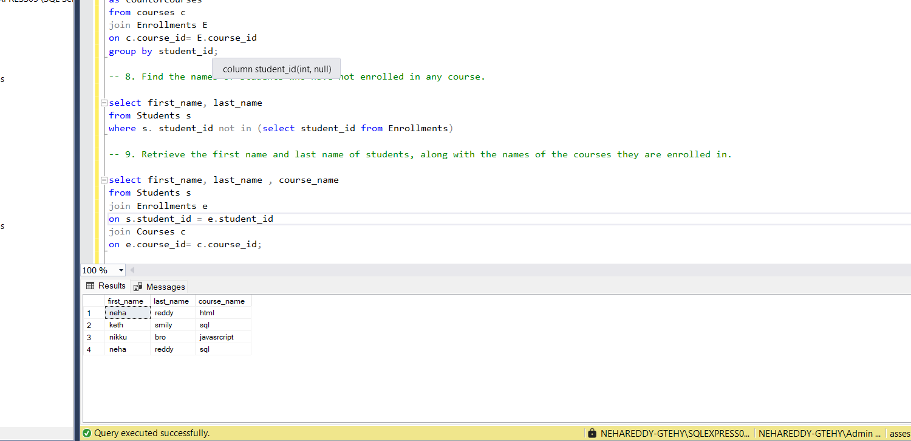

## 10. List names of teachers and the courses they are assigned to.

```sql
select  first_name, last_name, course_name
from Teachers t
join Courses c
on c.teacher_id = t.teacher_id;
```

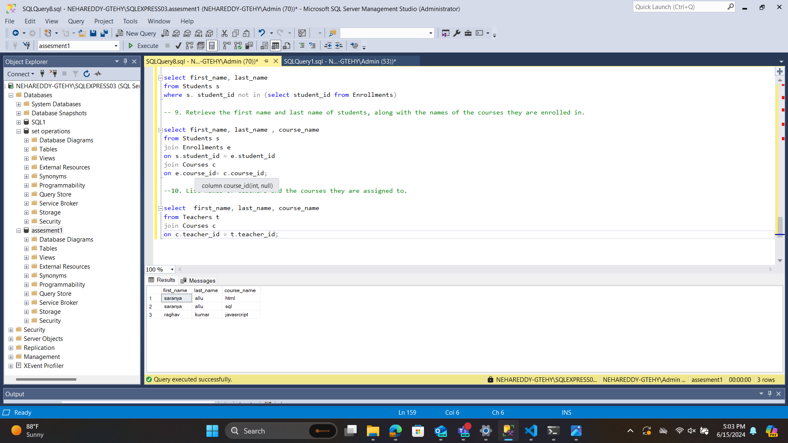

## 11. Calculate the average number of students enrolled in each course using aggregate functions and subqueries.

## 12. Identify the student(s) who made the highest payment using a subquery.

```sql
select student_id, max(amount)
from Payments p
group by student_id
having max(amount) = (select  max(amount) as maximum
                                       from Payments);

```

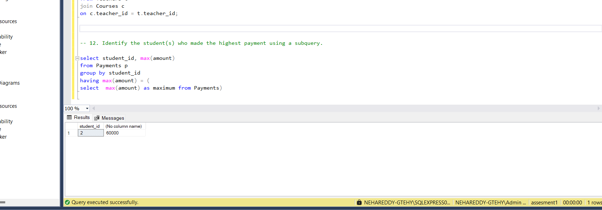

## 13. Retrieve a list of courses with the highest number of enrollments using subqueries.

## 14. Calculate the total payments made to courses taught by each teacher using subqueries.

**1.using sub queries**

```sql
select t.teacher_id,
       t.first_name,
	   t.last_name,
( select sum(p.amount)
  from payments p
  where p.student_id in
		      (select e.student_id
			   from Enrollments e
               where e.course_id in
					        ( select c.course_id
							  from Courses c
                              where c.teacher_id = t.teacher_id
							)
               )
)
as totalamount
 from Teachers t
order by totalamount desc;
```

**2. Using joins**

```sql

select t.teacher_id, t.first_name, t.last_name, sum(p.amount) as totalamount
from Teachers t
join Courses c
on c.teacher_id = t.teacher_id
join Enrollments e
on e.course_id = c.course_id
join Payments p
on p.student_id = e.student_id
where c.course_id in (
    select course_id
    from Courses
    where teacher_id = t.teacher_id
)
group by t.teacher_id, t.first_name, t.last_name
order by totalamount desc;
```

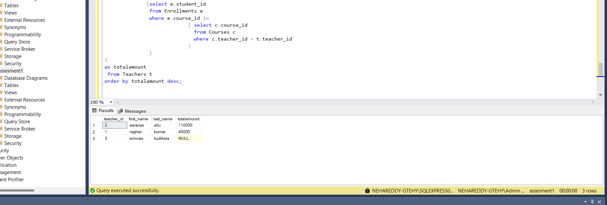

## 15. Identify students who are enrolled in more than one course.

**1. Using sub queries**

```sql
select
    s.student_id,
    s.first_name,
    s.last_name,
    (
        select count(e.course_id)
        from enrollments e
        where e.student_id = s.student_id
    ) as totalstudents
from students s
where exists (
    select *
    from enrollments e
    where e.student_id = s.student_id
    having count(e.course_id) >1 );
```

**2. Using joins**

```sql
select  s.student_id,
        s.first_name,
		s.last_name,
		Count(e.course_id) as totalStudents
		from Students s
join Enrollments e
on e. student_id = s.student_id
where course_id in (select course_id
                    from Enrollments )
group by  s.student_id,
          s.first_name,
		  s.last_name
having Count(e.course_id) > 1;
```


